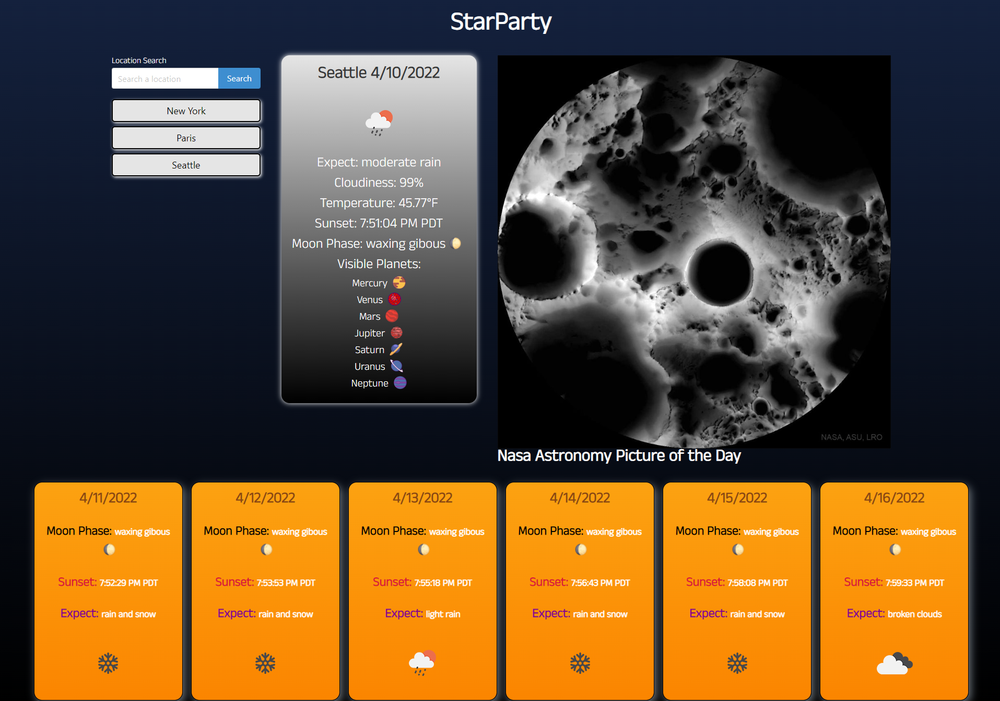

# StarParty

This application delivers the weather forecast and various astronomy information to a user based on their selected city input.

## Purpose

The purpose of this project was to work in a team to develop an application using HTML, JavaScript, CSS, a CSS framework, and multiple APIs.

## Goal

The goal of this project was to deliver a dynamic application that forecasts the weather as well as informs the user on astronomical data based on their location input.

The user opens a landing page that houses a location input and NASA's astronomy picture of the day. When the photo is clicked the user will be shown information for that photo. When the user inputs a location they will be redirected to the main application page.

The main application page displays the user with their search history, current weather/astronomy data, NASA's astronomy picture of the day, and a weather/astronomy forecast. The user can click on previous locations they have searched to display that location's data again. Clicking on NASA's astronomy picture of the day will open another window that takes the user to NASA's astronomy picture of the day website. The user will also be shown weather data, sunset time, moon phase, and visible astronomical objects.

## APIs Used

- [NASA Astronomy Picture of the Day](https://api.nasa.gov/planetary/apod)
- [Visible Astronomical Objects](https://visible-planets-api.herokuapp.com/v2?latitude=32&longitude=-98)
- [Open Weather](https://openweathermap.org/api/one-call-api)
- [Geocoding API](https://openweathermap.org/api/geocoding-api)

## Collaborators

- [Sophie Miller](https://github.com/millersg47)
- [Nathan Kilcrease](https://github.com/batemanz)
- [Ayami Higashi](https://github.com/hiayami)
- [Courtney Struelens](https://github.com/struelensc)

## Deployment

See below for a screenshot of the application and a link to the deployed webpage.

https://millersg47.github.io/StarParty/

### Landing Page

### Main Page

